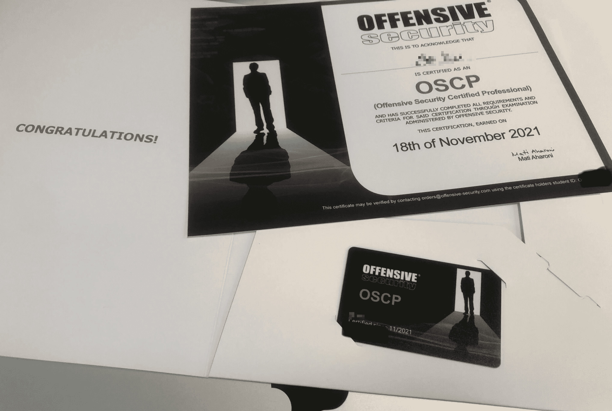
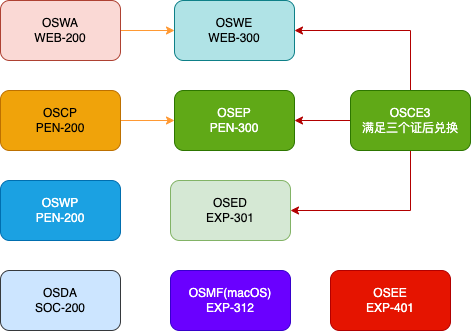

# OSCP（Offensive Security Certified Professional）

目前通过自学已经取得 [OSCP（Offensive Security Certified Professional）](https://www.credly.com/badges/0fe363a0-af32-4976-a098-a55b92fc3563/public_url) 证书，本项目用于记录分享交流。

更多可以查看我的通过之旅：[我的OSCP之旅回顾与分享](https://www.jgeek.cn/article/90.html)

# all certification

# 一起学习，共勉

